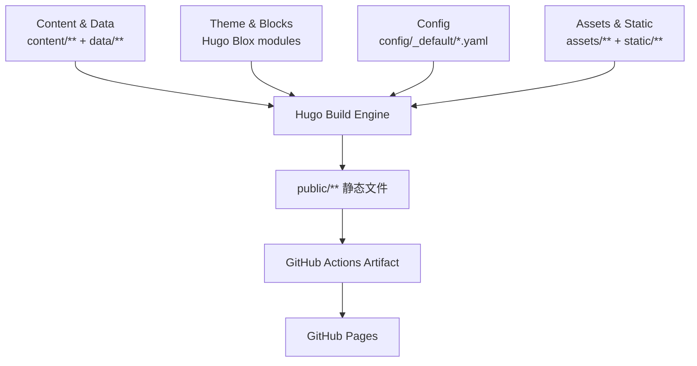

# 简历网站架构设计与实现原理

## 1. 目标与设计原则

本项目是基于 Hugo + Hugo Blox 的双语（中文/英文）静态简历网站，核心目标是：

- **内容优先**：全部内容以 Markdown/YAML 维护，避免后台系统依赖。
- **高性能与低成本**：静态站点生成，部署到 GitHub Pages，运维成本低。
- **可持续演进**：页面结构由 Block 组合，便于按模块扩展。
- **中英文一致性**：通过 Hugo 多语言机制实现统一模板、分语言内容。

---

## 2. 总体架构

架构分为 4 层：

1. **内容层**：`content/en`、`content/zh`（页面编排与文案）。
2. **数据层**：`data/authors/me.yaml`、`data/zh/authors/me.yaml`（结构化简历信息）。
3. **渲染层**：Hugo + Hugo Blox Block（`resume-biography-3`、`resume-experience` 等）。
4. **交付层**：GitHub Actions 构建后部署到 GitHub Pages。

---

## 3. 目录与职责划分

- `content/en`、`content/zh`
  - 页面入口与 Block 编排（首页、经历、项目）。
  - 例如首页使用 `resume-biography-3`，经历页使用 `resume-experience`/`resume-skills`。
- `data/authors/me.yaml`、`data/zh/authors/me.yaml`
  - 作者资料的结构化“单一事实源”（bio、experience、skills、awards 等）。
- `config/_default`
  - `hugo.yaml`：站点级参数（语言默认值、输出格式、构建行为）。
  - `languages.yaml`：语言与目录映射（`en -> content/en`, `zh -> content/zh`）。
  - `menus.yaml`：英文主菜单；中文在 `languages.yaml` 中定义本地化菜单。
  - `params.yaml`：Hugo Blox 主题参数（header/footer/search/theme 等）。
  - `module.yaml`：Hugo Modules 导入与挂载。
- `static/uploads`
  - 简历 PDF 静态资源，构建后直接按路径暴露。
- `scripts/export-template-pdf.mjs`
  - 通过 Puppeteer 将 HTML 模板导出为中英文 PDF。
- `.github/workflows`
  - `build.yml`：构建与产物上传。
  - `deploy.yml`：调用 build 并发布到 GitHub Pages。

---

## 4. 页面实现原理（Block 驱动）

### 4.1 首页（Bio）

首页是 `type: landing` 页面，由 `sections` 组装：

- `resume-biography-3`：头像、姓名、简介、下载按钮、教育/兴趣等。
- `markdown`：补充“About My Work”自由文本说明。

关键原理：

- `content.*.username: me` 将 Block 数据绑定到 `data/**/authors/me.yaml`。
- 页面骨架在 `content`，数据在 `data`，做到“结构与内容分离”。

### 4.2 经历页（Experience）

经历页同样是 landing 页面，通过 Block 组合：

- `resume-experience`
- `resume-skills`
- `resume-awards`
- `resume-languages`

其中 `date_format` 按语言独立配置，保证中英文化展示一致但格式本地化。

### 4.3 项目页（Projects）

项目页目前采用 Markdown 手工编排（章节 + 列表），优势是表达自由度高，适合长段落叙事与技术栈明细。

---

## 5. 多语言与路由机制

多语言由 Hugo 原生机制驱动：

- `config/_default/languages.yaml` 定义语言、locale、`contentDir`。
- `defaultContentLanguage: zh` 且 `defaultContentLanguageInSubdir: false`：
  - 中文默认在根路径。
  - 英文在 `/en/` 子路径。

### 5.1 URL 设计要点

- 菜单首页项使用 `url: ''`，避免在 GitHub Pages 子路径部署时出现错误拼接。
- 下载链接根据语言路径做相对处理，避免被错误附加语言前缀。

这类规则的本质是：**尽量避免硬编码绝对路径，优先使用与部署前缀兼容的写法**。

---

## 6. 构建与部署链路

### 6.1 本地开发与构建

- `pnpm dev`：本地预览页面。
- `pnpm run resume:pdf`：生成中英文 PDF 到 `static/uploads`。
- `pnpm build`：先执行 `resume:pdf`，再构建站点与搜索索引。

### 6.2 CI 与发布

- `build.yml` 负责安装依赖、生成 PDF、构建站点并上传产物。
- `deploy.yml` 复用 build 结果发布到 GitHub Pages。

---

## 7. PDF 简历产物链路（Puppeteer）

PDF 生成采用独立脚本 `scripts/export-template-pdf.mjs`：

- 输入模板：`resume-data/templates/resume_template_{cn,en}.html`
- 输出文件：`static/uploads/Peng_Zhang_resume_{cn,en}_2026.pdf`
- 生成方式：Puppeteer 打开本地 HTML 后导出 A4 PDF
- 执行入口：`pnpm run resume:pdf`

脚本会优先使用 `CHROME_BIN`，否则自动探测本机 Chrome/Chromium；在 CI 中可通过 `CI=true` / `PUPPETEER_NO_SANDBOX=1` 启用无沙箱参数。

站点页面直接引用 `/uploads/*.pdf`，无需额外文件服务或对象存储中转。

---

## 8. 当前架构优点与权衡

### 优点

- 结构清晰：内容、数据、配置、脚本分层明确。
- 可维护性高：页面改版主要改 `content`，履历更新主要改 `data/authors`。
- 部署稳定：纯静态产物，CDN 友好，回滚简单。

### 权衡

- 项目页是长 Markdown，结构化复用能力低于“数据驱动渲染”。
- `resume-data/sources/*.yaml` 与 `content/data` 之间目前偏人工同步。

---

## 9. 演进建议

1. **项目页数据化**
   - 将项目列表抽到 `data/projects.{yaml,json}`，模板循环渲染，减少重复编辑。
2. **内容生成自动化**
   - 增加脚本把 `resume-data/sources/*.yaml` 转换为 `content/data` 目标文件。
3. **链接健壮性校验**
   - 在 CI 增加链接检查（语言前缀、PDF 路径、菜单路由）。
4. **统一路径策略文档化**
   - 明确“菜单用相对空路径、资源用 root-relative 或语言相对”的团队约定。

---

## 10. 快速维护指南

- 更新个人经历/技能：编辑 `data/authors/me.yaml` 与 `data/zh/authors/me.yaml`。
- 更新页面文案与板块顺序：编辑 `content/en/*.md`、`content/zh/*.md`。
- 更新导航：编辑 `config/_default/menus.yaml`（英文）和 `config/_default/languages.yaml`（中文）。
- 本地预览：`pnpm dev`。
- 重新生成 PDF：`pnpm run resume:pdf`。
- 本地构建验收：`pnpm build`。

